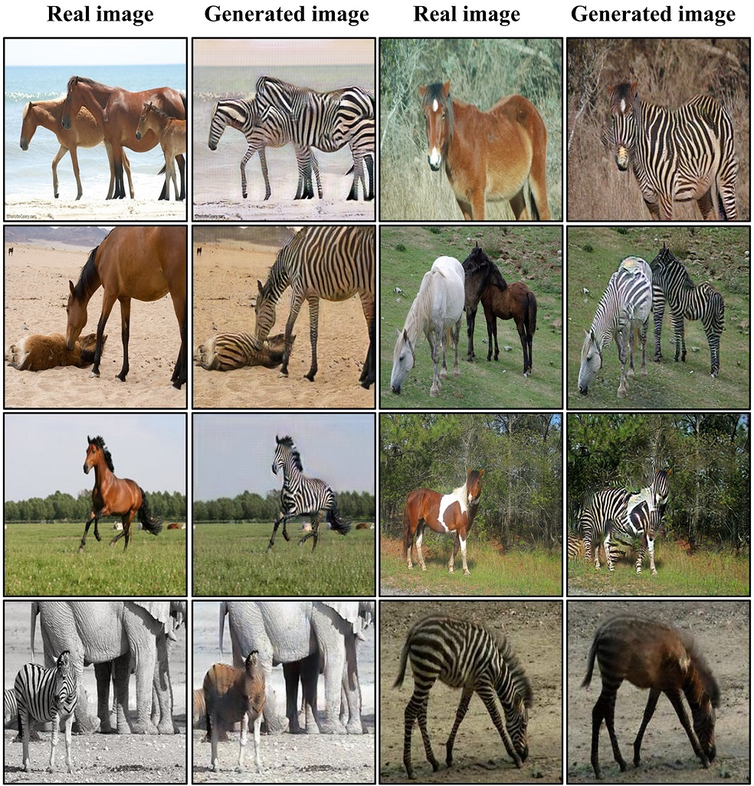

## CycleGAN PyTorch Implementation
# Dataset
The structure of your dataset should be:
```
├── datasets
   └── Dataset_name
       ├── trainA
           └── ...
       ├── trainB
           └── ...
       ├── testA
           └── ...
       └── testB
           └── ...
```
The directory for --dataroot and --saveroot should in form 'X_dir/Y_dir/' if the directory depth is 2

# Train
Sample code for training:
```Bash
python train.py --dataroot datasets/horse2zebra/  --saveroot horse2zebra/output/ --device cuda:0 --batch_size 8

```
Training and testing only support single GPU, a specific device name should be provided if cannot use cuda:0
Recommend batch size: 1 for GPU ram >= 6GB, 4 for GPU ram >= 12GB, 8 for GPU ram >= 24GB, 16 for GPU ram >= 40GB

# Test
Sample code for testing:
```Bash
python test.py --dataroot datasets/horse2zebra/  --path_gA2B Result/train/horse2zebra/output/G_AB.pth --path_gB2A Result/train/horse2zebra/output/G_BA.pth --saveroot horse2zebra/
```
Note: --path_gA2B and --path_gB2A should provide the exact path of the generator

You can add ``--mode A2B`` or ``--mode B2A`` for one-way translation.

# Sample
We also provide a notebook ```Implemented_CycleGAN.ipynb``` for sample use. Please feel free to take a trial!

# Our result
All of our results of the project are trained and tested locally, we include the training and testing results in /Result directory and upload them to Google Drive, and please check options to customize the training and testing process in train.py and test.py
Below shows our results:
<div align="center" width=384>
  
</div>

Please download to see our Result data (trained and tested) and horse2zebra data (for training and testing) from link below: 
https://drive.google.com/drive/folders/1ltpOsW8cirFfeskcd3m0PJ1jg77XqtrB?usp=sharing 
